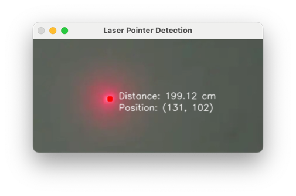
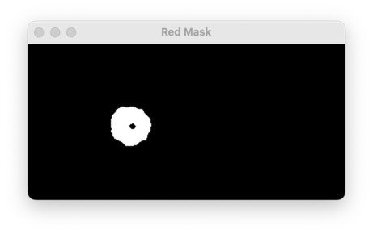
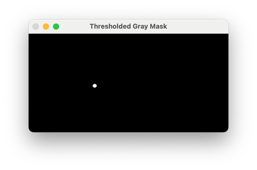
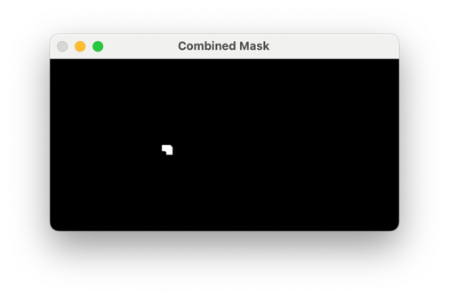

# Laser Pointer Detection Application

This Python application detects a laser pointer's position and distance in real-time using a webcam feed. The
application identifies laser points up to 2 meters away, with an accuracy tolerance of ±10 cm. It visualizes the
detected laser point on the screen, displaying its coordinates and estimated distance from the camera. The application
is built using OpenCV for image processing and Tkinter for adaptive screen sizing.

## Table of Contents

- [Code Repository](#code-repository)
- [Features](#features)
- [Installation](#installation)
- [Usage](#usage)
- [Configuration](#configuration)
- [Project Structure](#project-structure)
- [Testing](#testing)

## Code Repository

https://github.com/CharlesZZY/Laser-Pointer-Detection

## Features

- **Real-time Detection**: Continuously detects laser points through a live webcam feed.
- **Distance Estimation**: Estimates the laser pointer’s distance from the camera within a 2-meter range, with a 10 cm
  tolerance.
- **Visual Feedback**: Displays laser pointer coordinates and distance on the video feed.
- **Mask Visualization**: Shows different image masks for debugging and precise laser localization.

## Installation

1. **Clone the repository**:
   ```bash
   git clone https://github.com/CharlesZZY/Laser-Pointer-Detection.git
   cd Laser-Pointer-Detection
   ```

2. **Install required dependencies**:
   Ensure Python 3.9+ is installed. Then, install the dependencies:
   ```bash
   pip install -r requirements.txt
   ```

3. **Setup directories**:
   Create necessary directories for test images and outputs if they do not exist:
   ```bash
   mkdir images output
   ```

4. **Add a test image**:
   Place a test image named `test.jpg` in the `images` directory to run tests if there is no `test.jpg`.

## Usage

1. **Run the application**:
   ```bash
   export PYTHONPATH=.
   python src/main.py
   ```
2. **Exit**:
   Press `q` to exit the application.

When running, the application detects a red laser point and displays its position and estimated distance on the screen.
The live feed also shows debug masks that illustrate the detection process.

### Example Output

Below are sample outputs generated by the application to demonstrate the detection and mask functionality.

**Main Detection Window**



**Masks Used for Detection**

- **Red Mask**: Shows the mask for red colors used to detect the laser pointer.



- **Thresholded Gray Mask**: Grayscale threshold mask for isolating high-intensity laser points.



- **Combined Mask**: Combines the red mask and grayscale threshold mask for accurate laser point localization.



## Configuration

Laser detection and distance estimation parameters can be adjusted in `src/config.py`:

```python
CONFIG = {
    "laser_color_range": {
        "lower1": (0, 100, 160),  # Lower range for red hues
        "upper1": (10, 255, 255),  # Upper range for red hues
        "lower2": (160, 100, 160),
        "upper2": (180, 255, 255)
    },
    "distance_threshold": 200  # Maximum distance for detection (in cm)
}
```

- **Laser Color Range**: Defined in HSV color space for detecting the red laser pointer.
- **Distance Threshold**: Maximum allowable distance (in cm) for reliable detection, set to 200 cm (2 meters).

## Project Structure

```
laser-pointer-detection/
│
├── src/
│   ├── main.py                    # Main application logic for laser detection
│   ├── laser_detection.py          # Laser detection logic and distance estimation
│   ├── utils.py                    # Helper functions for drawing laser point
│   └── config.py                   # Configuration file for laser color and distance thresholds
│
├── tests/
│   ├── test_detection.py           # Unit tests for detection and distance estimation
│
├── images/                         # Folder to store test images (e.g., test.jpg)
├── output/                         # Folder to save processed images and masks during testing
│
├── assets/                         # Folder storing example output images for README
│   ├── Red Mask.png
│   ├── Combined Mask.png
│   ├── Laser Pointer Detection.png
│   └── Thresholded Gray Mask.png
│
├── requirements.txt                # List of required packages
└── README.md                       # Project documentation
```

## Testing

Unit tests ensure the accuracy of laser detection and distance estimation functions. The main test
file, `tests/test_detection.py`, verifies the following:

- **Laser Detection**: Detects laser point in a test image, saves annotated images and masks to the `output` folder.
- **Distance Estimation**: Confirms that distance calculations for various laser point sizes remain within expected
  thresholds.

### Running Tests

1. Place a test image `test.jpg` in the `images` folder.
2. Run the tests:
   ```bash
   python -m unittest discover -s tests
   ```

---

This application is designed to accurately and reliably detect laser pointers within a controlled range, providing a
foundation for advanced real-time object tracking systems.